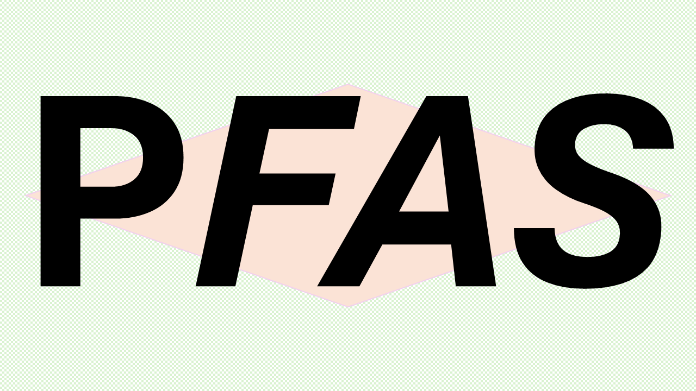

[](https://www.repostatus.org/#wip)
[](https://pfas.readthedocs.io/en/latest/)
[](https://pypi.org/project/pfas/)
[](https://pypi.org/project/pfas/)
# PFAS - *a package for semi-analytical modeling of PFAS transport in the vadose zone*



A Python package for modeling the transport of per- and polyfluoroalkyl substances (PFAS) through the unsaturated zone.

## Overview

PFAS is a toolkit for simulating the movement and fate of PFAS contaminants in the unsaturated zone. It provides a flexible, modular framework for constructing transport models with configurable preprocessing steps and analytical solvers. The package is designed for researchers and engineers studying PFAS contamination and remediation.

## Features

- **Modular Architecture**: Build complex transport models using pluggable preprocessors and solvers.
- **Flexible Configuration**: Define simulations using intuitive TOML configuration files or directly in code.
- **Sorption Modeling**: Support for linear and non-linear sorption processes to soil particles and Air-Water Interface, in combination with flexible approaches for defining these processes.
- **Vadose Zone Transport**: Simulate PFAS movement through the unsaturated zone under steady-state flow conditions.
- **Embedded PFAS data**: The package contains modules with sorption data for Air-Water interface computation, Air-Water interfacial sorption coefficients and solid phase sorption coefficients.
- **Grid Generation**: Automatic mesh generation for spatial domains
- **Boundary Condition Management**: Flexible handling of domain boundaries

## Requirements

- Python >= 3.9
- NumPy >= 2
- SciPy
- Matplotlib
- Pydantic
- Marimo (for tutorials)

## Installation

### From PyPI

```bash
pip install pfas
```

### From Source

```bash
git clone https://github.com/UU-PFAS-Living-Lab/pfas.git
cd pfas
pip install -e .
```

### For Development

Install with additional testing, documentation, and example dependencies:

```bash
pip install -e ".[dev]"
```

Or install individual extras:

```bash
pip install -e ".[test]"      # For testing
pip install -e ".[docs]"      # For building documentation
pip install -e ".[examples]"  # For running examples
```

## Quick Start

Here's a minimal example to get started:

```python
from pfas.configuration import read_toml
from pfas.preprocessing import (
    WaterPreprocessor,
    BoundaryPreprocessor,
    GridGenerator,
    SpRetardationPreprocessor,
    SWCAdsorptionPreprocessor,
    SorptionKawiDirectInput,
    SimulationRunner
)
from pfas.model import Model

# Load configuration from file
config = read_toml("examples/data/config.toml")

# Create and configure the model
model = (Model(config)
    .add(WaterPreprocessor, porosity=0.4)
    .add(BoundaryPreprocessor)
    .add(GridGenerator)
    .add(SpRetardationPreprocessor)
    .add(SWCAdsorptionPreprocessor)
    .add(SorptionKawiDirectInput)
    .add(SimulationRunner)
)

# Access results
data = model.generated_data
C_tot = data["C_tot"]  # Total PFAS concentration
grid = data["grid"]    # Grid information
```

## Documentation

Full documentation is available at [Read the Docs](https://pfas.readthedocs.io/). 

## Examples

Several example scripts are provided in the `examples/` directory, demonstrating:

- `data_structure.py` - Data structure handling
- `initial_value_problem.py` - Setting up initial value problems
- `Kd_sorption.py` - Linear sorption (Kd) modeling
- `factory.py` - Factory patterns for model creation
- `gen_example.py` - Configuration generation

To run these examples, you need Marimo.

## License

This project is licensed under the MIT License - see the [LICENSE](LICENSE) file for details.

## Citation

If you use PFAS in your research, please cite:


## Contributing

Contributions are welcome! Please feel free to submit a Pull Request.

## Contact

For questions and support, please contact: Valerie de Rijk (v.derijk@uu.nl)

## Acknowledgments

This package was developed at Utrecht University as part of the PFAS Living Lab.

